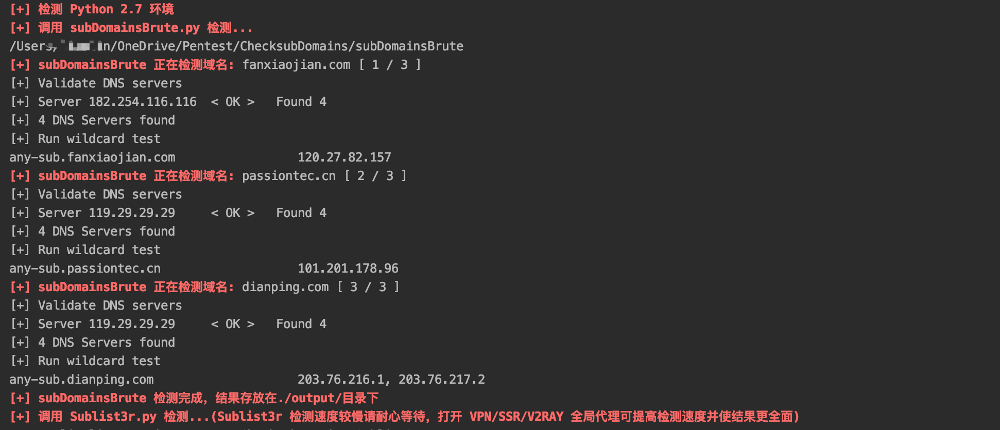

# 介绍
在 subDomainsBrute 和 Sublist3r 上二次开发，添加了批量检测的功能，并整合 subDomainsBrute 和 Sublist3r 结果。

**运行之前请打开 SSR/VPN/V2Ray 全局代理，可以显著提高检测速度和结果的准确性**

**源项目:**
- subDomainsBrute（https://github.com/lijiejie/subDomainsBrute）
- Sublist3r（xxx）

# 安装与环境
- 安装 python 2.7

- 安装 python 模块：`pip install -r requirements.txt`

# 使用方法
- 输入：需要检测的域名写入到 ./input/domains.txt 
- 输出：检测结果存放在 ./output/文件夹中，结果按照 domainname.txt 存放
- 调用 Sublist3r 时，Sublist3r 的扫描结果会暂时存放在 ./Sublist3r/output 目录，检测完成后会合并到 ./output 并去重
- 启动扫描：`python2.7 CheckSubDomains.py`

# CheckTools 介绍（流程）

